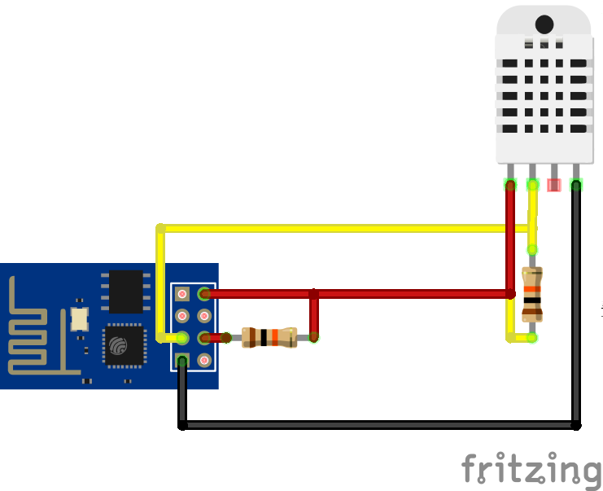

# Wifi temperature sensor with ESP-01 and DHT22

## Setup
- Create a custom build of [NodeMCU 1.5.4.1-final](https://nodemcu-build.com/), with modules: **DHT, file, GPIO, HTTP, net, node, timer, UART, WiFi**
- On the ESP-01, wire GPIO0 to GROUND together to enable **flash mode**
- Use [esptool](https://github.com/espressif/esptool) to flash the wifi module with the custom firmware (float version)
- Download ESP8266 / NodeMCU / MicroPhython IDE [ESPlorer](https://github.com/4refr0nt/ESPlorer)
- In **ESPlorer**, switch to **NodeMCU/MicroPython** tab
- Change settings in `config.lua`
- Rename `pull.lua` or `push.lua` to `init.lua`
- Upload `config.lua` and `init.lua` to the wifi module by clicking on **Save to ESP**

## Parts & Tools

### Components
- [ESP-01](http://www.icstation.com/esp8266-remote-serial-port-wifi-transceiver-wireless-module-apsta-p-4928.html)
- [DHT22](http://www.icstation.com/dht22am2302-digital-output-temp-sensor-module-temperature-humidity-sensor-dht22-p-1469.html)

### Development
- [USB to ESP8266 Serial Wireless Wi-Fi Module](http://www.icstation.com/wifi-module-esp8266-pinboard-cellphonepc-wireless-communication-p-8857.html)
  - [Driver (ch340)](http://sparks.gogo.co.nz/ch340.html)
- Custom development board

## Wiring

## References
- [Adafruit ESP8266 Temperature / Humidity Webserver Tutorial](https://learn.adafruit.com/esp8266-temperature-slash-humidity-webserver)
- [Wiring the ESP8266 As Stand Alone](http://www.14core.com/wiring-the-esp8266-as-stand-alone/)
- ESP8266 [Wikipedia](https://en.wikipedia.org/wiki/ESP8266) | [ESP8266 Community - Module Family](http://www.esp8266.com/wiki/doku.php?id=esp8266-module-family)

### Documentation
- [NodeMCU Documentation](https://nodemcu.readthedocs.io/en/dev/)

### Datasheet
- [ESP-01 WiFi Module](http://ecksteinimg.de/Datasheet/Ai-thinker%20ESP-01%20EN.pdf)
- [DHT22](https://cdn-shop.adafruit.com/datasheets/DHT22.pdf)

## Further reading
- [Hack to enable deep sleep mode on the ESP-01](https://hackaday.com/2015/02/08/hack-allows-esp-01-to-go-to-deep-sleep/)